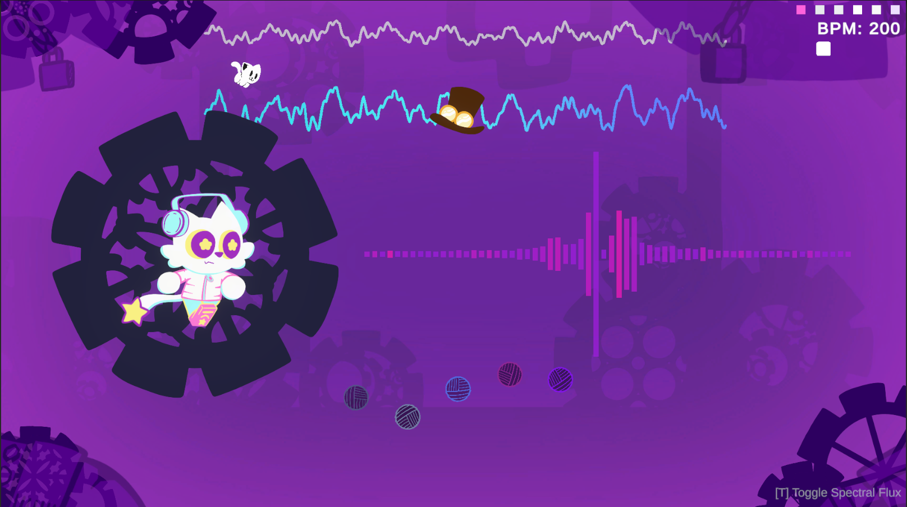
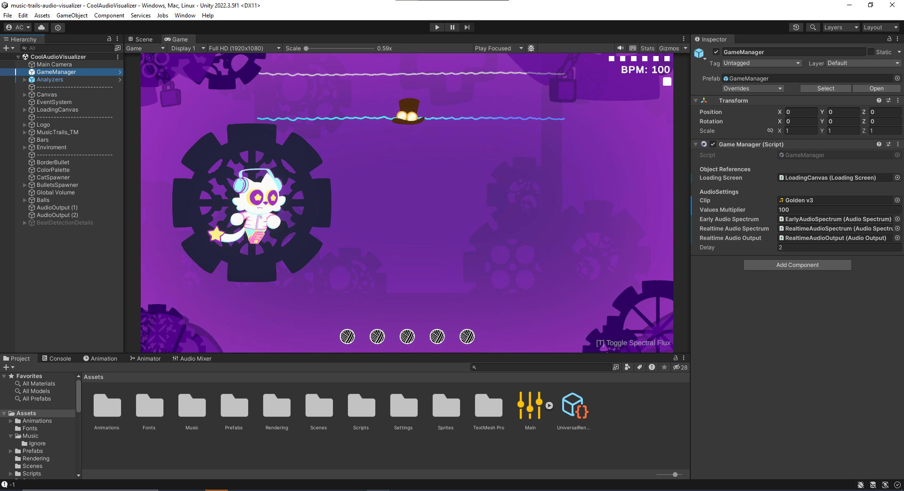
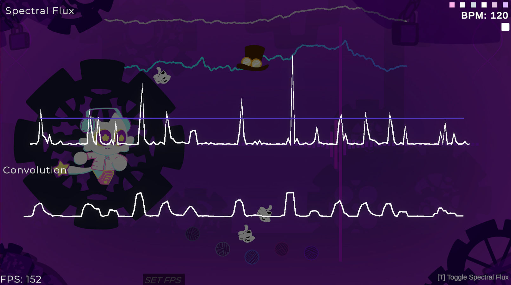
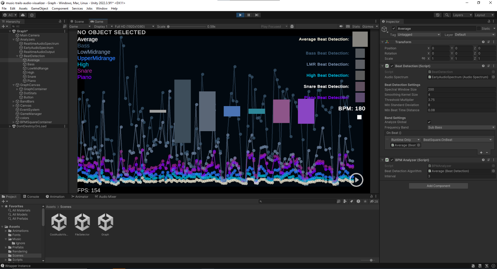
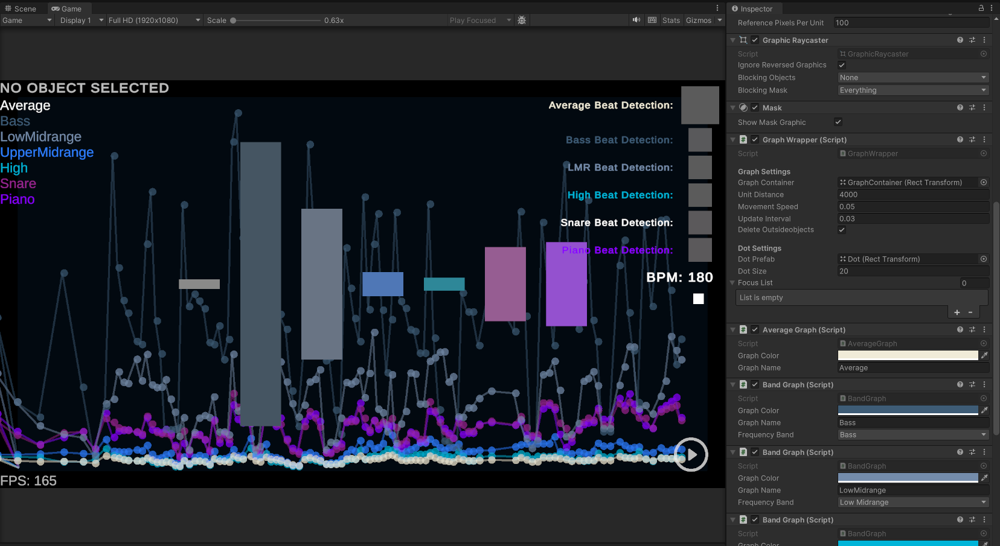
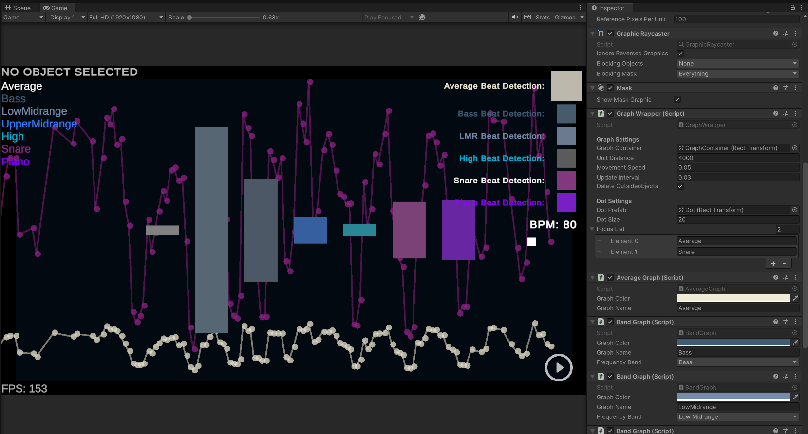

# 🎵 Music Trails Beat Detection Algorithm 

> A rhythm-based game research project by Aless 

Welcome to the repository about **Music Trails**, a project on how we can use realtime audio data to influence gameplay. This repository includes the full Unity project source code, and examples of audio-based interactions like the visualizeer, as well as a downloadable release for those who want to see it in action without opening the Unity project.  

## What’s Included?  

1. **Unity Project:**  
   - **Audio Visualizer Scene**: A dynamic scene showcasing audio-reactive visuals, beat detection, and frequency-based objects.  
   - **Audio Graph Scene**: A visual representation of audio analysis techniques, great for understanding the underlying algorithms.  

2. **Release Build**  
   - For users who don’t have Unity, download the pre-built executable from the release tab at your right

3. **Research Documentation**  
   - I've explained all the process and research [here](https://deeply-dodo-5c9.notion.site/Music-Trails-Research-60fd7dc2b13c4d809a78fc6d103b411a?pvs=4)

## Features  

### Audio Visualizer Scene  

- **Frequency Bars:** React to the music in real-time by splitting the frequency spectrum into bars.  
- **Environment Animations:** Gears rotate and balls move in response to audio frequencies.  
- **Beat Detection:** Visual indicators for beats using spectral flux analysis.  
- **Dynamic Visuals:** Animated characters and objects that react to music properties. 
- Use `T` to toggle the audio spectrum details 

### Audio Graph Scene  

- View real-time spectral flux and adaptive threshold calculations.  
- Analyze audio data through clear, visual feedback.  

> [!NOTE]
> Inside the scene you'll find an object called **Graph Canvas**. 
> It manages the graph and it can be used to analyze different frequencies.
> 
> The **Focus List** property is used to filter frequencies, if empry it shows all frequencies.
> 
> While if you add the frequency name as element it will only show the ones you've written.
> Sometimes it bugs out, to fix it you can just add and remove an element.

## How to Use  

### Option 1: Use the executable  
- Go to the releases tab.  
- Download the `.zip` file and extract it.  
- Run the executable!
- I also provided 2 sample songs you can try made by [SO_Snake](https://www.youtube.com/@SO_Snake)

### Option 2: Open the Unity Project  
- Clone the repository or download it as a `.zip`.  
- Open the project in Unity.  
- Check out the **CoolAudioVisualizer** and **Graph** scenes.  

## Future Plans  

I plan on adding more things in the future as I develop this game.

- I should adjust settings for the algorythm based on the genre in order to get more accurate results.
- I should add a minimum threshold as well to reduce false positives. (It could be calculated using the GetOutputData functions as it could describe how calm or loud songs are)
- Have 2 thresholds, one on a big window and the other on a smaller one
- Add a decay factor
    
    The decay factor (0.95, for example) means:
    
    - Each frame, the threshold is reduced by 5%
    - This allows the threshold to "forget" old peaks gradually
- Complex Phase processing
    - But I’m a bit rusty on this and It sounds hard to implement
- Calculate output data value using standard deviation

Unfornately this year I’m way more busier with school so I’ll roll out these changes slowly as I work on other things.
